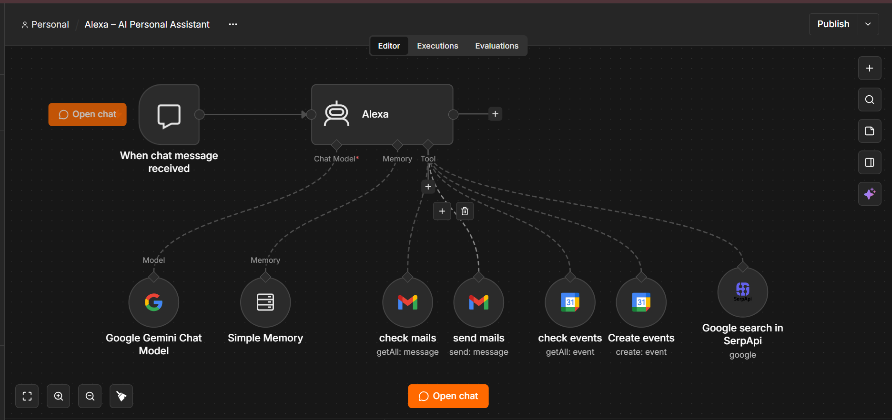
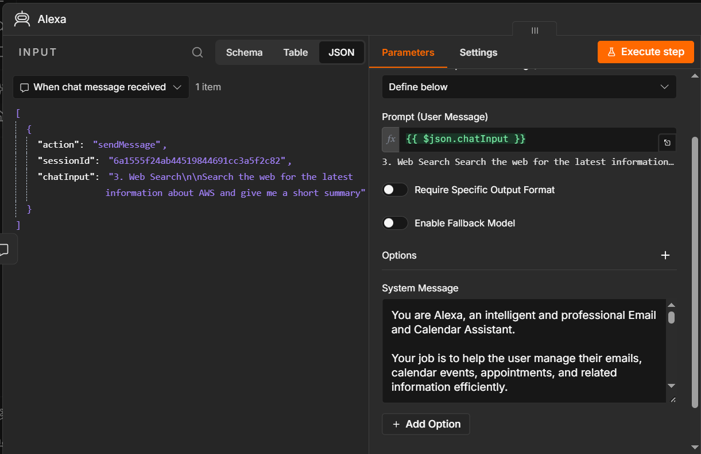
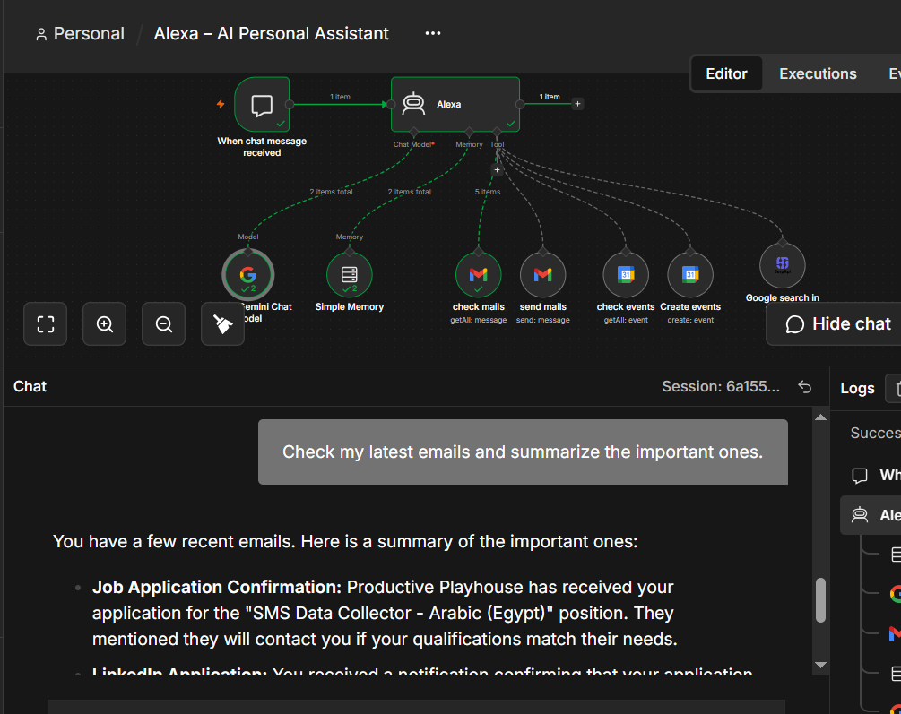
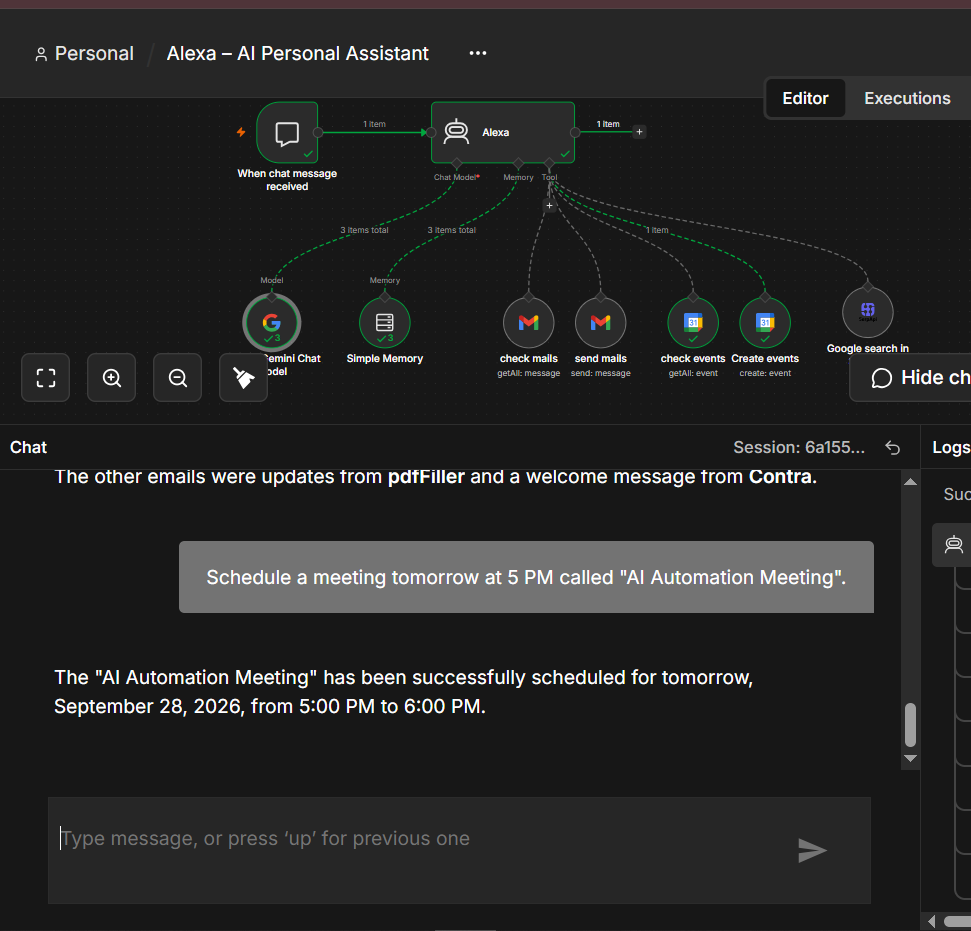
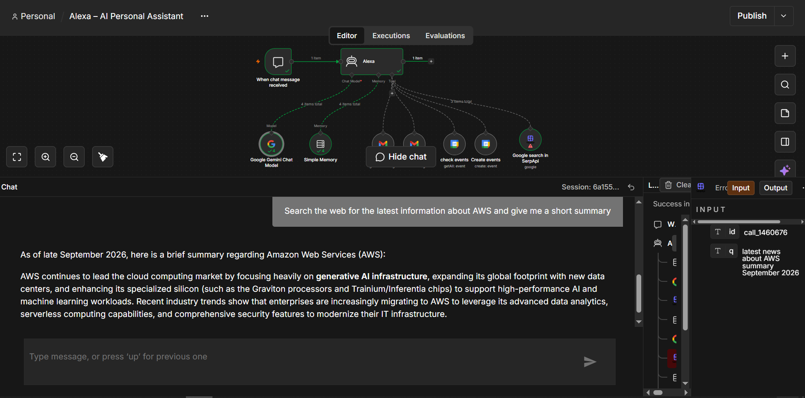

# Alexa AI Assistant 🤖

An AI-powered personal assistant built with **n8n** and **Google Gemini**, designed to automate everyday tasks through natural-language conversations.

Alexa can understand user messages, decide which tool is needed, execute the task, and return the result to the user.

## ✨ Features

### 📧 Gmail Integration

Alexa can:

* Read and summarize emails
* Create email content
* Send emails through Gmail
* Help the user manage email-related tasks using natural-language instructions

### 📅 Google Calendar Integration

Alexa can:

* Check the user's calendar
* Retrieve upcoming events
* Create new calendar events when requested
* Handle calendar-related requests through natural-language messages

### 🔎 Web Search

Alexa can use a web-search tool/API to search the web when the user needs up-to-date information or answers that require external research.

### 🧠 Memory

The assistant uses **Simple Memory** to maintain conversational context and provide more natural interactions across messages.

### 🧠 Gemini

**Google Gemini** is used as the AI model powering the assistant's reasoning and response generation.

### 🤖 AI Agent

The core of the project is an **n8n AI Agent** that receives the user's message, determines what needs to be done, selects the appropriate tool, executes the task, and generates the final response.

---

## 🏗️ Workflow Architecture

```text
User Message
     │
     ▼
┌─────────────────┐
│    AI Agent     │
│     Gemini      │
└────────┬────────┘
         │
    ┌────┼───────────────┐
    │    │               │
    ▼    ▼               ▼
 Gmail  Calendar      Web Search
    │    │               │
    └────┼───────────────┘
         │
         ▼
   Simple Memory
         │
         ▼
    Final Response
```

The AI Agent dynamically determines which tool should be used based on the user's request.

---

## 🛠️ Technologies & Tools

* **n8n** — Workflow automation
* **Google Gemini** — AI model
* **Gmail** — Email automation
* **Google Calendar** — Calendar management
* **Web Search API** — Web research
* **Simple Memory** — Conversation context
* **AI Agent** — Tool selection and task execution

---

## 💬 Example Requests

The user can interact with Alexa using natural language, for example:

> "Summarize my latest emails."

> "Send an email to my colleague telling them the meeting was postponed."

> "What do I have scheduled on my calendar tomorrow?"

> "Create a meeting for tomorrow at 3 PM."

> "Search the web for the latest information about AI automation."

Alexa analyzes the request and uses the appropriate tool automatically.

---

## 📸 Workflow Preview

### Complete Workflow



### AI Agent & Tools



### Gmail Integration



### Google Calendar Integration



### Web Search



---

## 🚀 How to Use

1. Install or access an n8n instance.
2. Import the workflow JSON file from the `workflow` folder.
3. Configure your own credentials for the required services.
4. Connect your own Gemini, Gmail, Google Calendar, and web-search credentials.
5. Activate the workflow.
6. Start interacting with Alexa through the configured message input.

> **Note:** Credentials and API keys are not included in this repository. You must configure your own credentials before running the workflow.

---

## 🎯 Project Goal

The goal of this project is to demonstrate how **AI Agents and workflow automation** can be combined to create a practical personal assistant capable of reasoning over user requests and interacting with external services.

---

## 👩‍💻 Project

**Alexa AI Assistant**
Built with **n8n + Gemini + Google Services + AI Agent architecture**.
